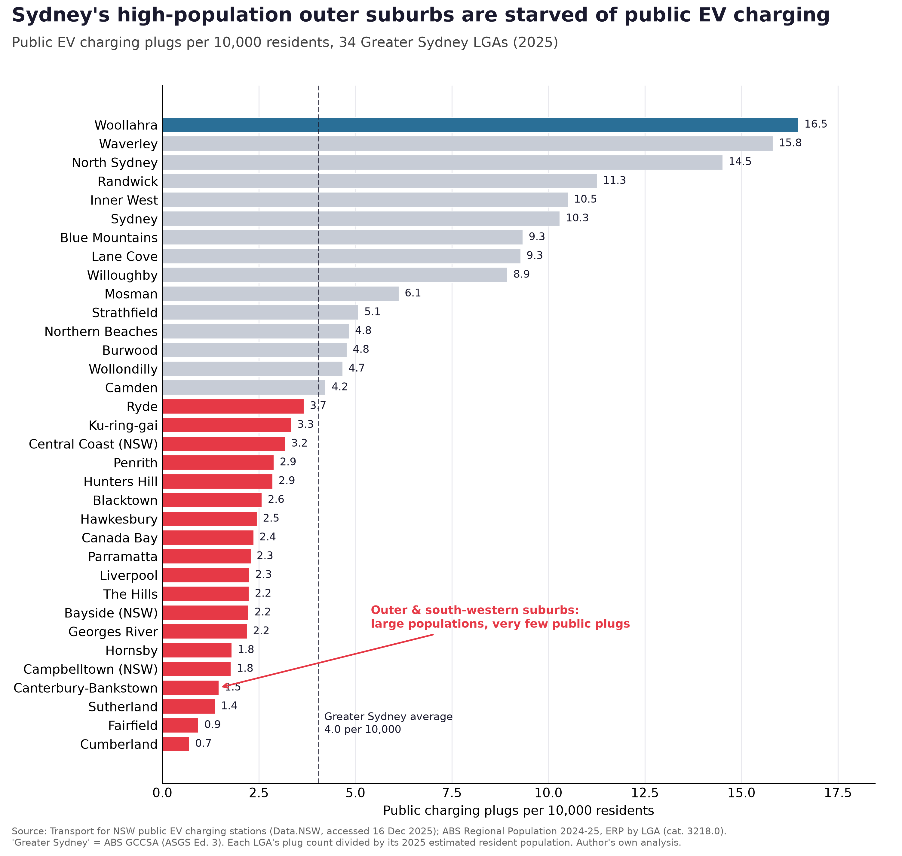

# COMM5501 Deliverable 2 — Fair Public EV Charging Access in NSW (SDG 11)

**Course:** COMM5501 Data Visualisation and Communication, UNSW T2 2026  
**Deliverable:** D2 — Good Graph, or Good Grief (Data Analysis & Visualisation)

---

## Project overview

This project investigates whether public EV charging infrastructure in Greater Sydney
is distributed fairly across LGAs. Using two government open-data sources, it computes
**public charging plugs per 10,000 residents** for each of the 34 Greater Sydney Local
Government Areas and shows that high-population outer-western and south-western suburbs
have up to 20× less per-capita access than affluent inner suburbs.

**Primary SDG:** SDG 11 — Sustainable Cities and Communities  
**Secondary SDGs:** SDG 13 (Climate Action), SDG 7 (Affordable and Clean Energy)

**Call to Action:** NSW transport and energy planners should prioritise public EV charging
rollout in under-served, high-population outer-suburban LGAs so the low-carbon transport
transition is geographically fair.

**Target Audience:** NSW transport and energy planners / local councils.

---

## Final chart

> `final_chart/deliverable2_final_chart.png` (300 dpi PNG)  
> `final_chart/deliverable2_final_chart.pdf` (vector PDF for print/slides)



---

## Data sources

| Dataset | Publisher | Licence | File |
|---------|-----------|---------|------|
| NSW public EV charging station locations | Transport for NSW / Data.NSW | CC-BY 4.0 | `ev_20251216.csv` |
| Regional Population 2024-25, by LGA (cat. 3218.0) | Australian Bureau of Statistics | CC-BY 4.0 | `data/abs_regional_population_lga_2024_25.xlsx` |
| Greater Sydney GCCSA (ASGS Ed. 3) LGA list | ABS | — | encoded in scripts |

- TfNSW EV charging data: <https://data.nsw.gov.au/data/dataset/electric-vehicle-charging-points>
- ABS Regional Population 2024-25: <https://www.abs.gov.au/statistics/people/population/regional-population/latest-release>
- ABS ASGS Greater Sydney: <https://www.abs.gov.au/statistics/standards/australian-statistical-geography-standard-asgs-edition-3/jul2021-jun2026>

---

## Repository structure

```
.
├── deliverable2_ev_charging_equity.ipynb   # Main deliverable (fully executed notebook)
├── ev_20251216.csv                         # Raw data: NSW EV charging stations
├── nsw_ev_uptake_charging_access_storywall.png  # v0 original StoryWall chart
│
├── data/
│   ├── abs_regional_population_lga_2024_25.xlsx  # Raw ABS population data (unmodified)
│   └── lga_charging_access.csv                   # Derived: plugs + population per LGA
│
├── final_chart/
│   ├── deliverable2_final_chart.png   # Submitted chart (300 dpi)
│   └── deliverable2_final_chart.pdf   # Vector version
│
├── outputs/
│   ├── v1_raw_plugs_by_lga.png        # Iteration v1
│   ├── v2_per_capita_all_lgas.png     # Iteration v2
│   ├── v3_greater_sydney_sorted.png   # Iteration v3
│   └── final_sydney_charging_equity.png  # Final (duplicate of final_chart/)
│
└── scripts/
    ├── fetch_abs_population.py   # Downloads ABS xlsx from the release page
    ├── analysis.py               # Core analysis + coverage check (standalone)
    └── make_final_chart.py       # Standalone: regenerates final chart from raw data
```

---

## How to reproduce

### Requirements
Python 3.12+ with:
```
pandas numpy matplotlib openpyxl requests jupyter nbconvert
```

Install with:
```bash
pip install pandas numpy matplotlib openpyxl requests jupyter nbconvert
```

### Run the full notebook
```bash
jupyter notebook deliverable2_ev_charging_equity.ipynb
```
Or execute non-interactively:
```bash
jupyter nbconvert --to notebook --execute --inplace deliverable2_ev_charging_equity.ipynb
```

### Regenerate the final chart only
```bash
python scripts/make_final_chart.py
```
Outputs: `final_chart/deliverable2_final_chart.png` and `.pdf`

### Re-download the ABS data
```bash
python scripts/fetch_abs_population.py
```

---

## Key finding

Within Greater Sydney's 34 LGAs, there is a 20× gap in public charging access per resident:

| LGA | Plugs per 10,000 residents |
|-----|---------------------------|
| Woollahra (inner east) | 16.5 |
| Waverley (inner east) | 15.8 |
| **Cumberland (outer west)** | **0.7** |
| **Fairfield (outer south-west)** | **0.9** |
| **Canterbury-Bankstown (south-west)** | **1.5** |

The Greater Sydney average is **4.0 plugs per 10,000 residents**. High-population outer suburbs
— where residents are least likely to have off-street home charging — are consistently the
most under-served.

---

## Iteration log summary

| Version | What changed | Why |
|---------|-------------|-----|
| v0 | NSW EV uptake over time (original StoryWall) | Does not address charging access or fairness |
| v1 | Total plugs per LGA (raw counts) | Right dataset, wrong metric — hides inequity behind LGA size |
| v2 | Plugs per 10k, all 129 NSW LGAs | Correct metric, but too many bars; tourist towns skew regional average |
| v3 | 34 Greater Sydney LGAs, sorted | Removes tourist-charger distortion; story visible but still neutral |
| **Final** | Highlighted outer suburbs, average reference line, takeaway title | Turns data dump into a clear, actionable argument |
